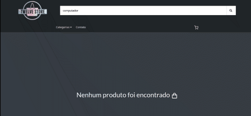
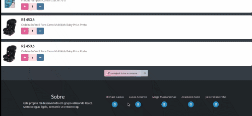

# Twelve Store

Projeto feito em grupo durante o curso da [Trybe](https://www.betrybe.com/) com o objetivo de treinar as metodologias ágeis com DM's e Kanbam, além de utilizarmos Redux para o gerenciamento de estados.

## 🔧 Funçoes

- Rota principal `/` com uma barra de pesquisa para pesquisar por nome de produto.
- Rota `/cart` para o acesso a modificação de produtos por quantidade.
- Rota `/checkout` para o acesso a checagem dos produtos, preço total e forma de pagamento.
- Listagem de produtos por categoria
- Tela de Loading
- Tela de detalhes do produto clicado com acesso a avaliações.

## Habilidades utilizadas

- Utilizar o Trello para organização em grupo.
- Utilizar o Redux para gerenciamento de estados.
- Utilizar o framework Semantic UI para realizar estilizações.

## Como iniciar

1. Faça o clone do projeto
2. Instale as dependências
```shell
npm install
```
3. Inicialize a aplicação
```shell
npm start
```

## Feito Com:
[](https://trello.com/)
[](https://code.visualstudio.com/)
[](https://developer.mozilla.org/pt-BR/docs/Web/React)
[](https://redux.js.org/)
[](https://developer.mozilla.org/pt-BR/docs/Web/JavaScript)
[](https://developer.mozilla.org/pt-BR/docs/Web/CSS)
[](https://semantic-ui.com/)

## 🤝 Colaboradores

Agradecemos às seguintes pessoas que contribuíram para este projeto:

<table>
  <tr>
    <td align="center">
      <a href="https://github.com/michaelcaxias">
        <br>
        <sub>
          <b>Michael Caxias</b>
        </sub>
      </a>
    </td>
    <td align="center">
      <a href="https://github.com/LucasAccurcio">
        <br>
        <sub>
          <b>Lucas Accurcio</b>
        </sub>
      </a>
    </td>
    <td align="center">
      <a href="https://github.com/Julioscoffee">
        <br>
        <sub>
          <b>Julio Fallace</b>
        </sub>
      </a>
    </td>
        <td align="center">
      <a href="https://github.com/cassiomasc">
        <br>
        <sub>
          <b>Cassio Mascarenhas</b>
        </sub>
      </a>
    </td>
        <td align="center">
      <a href="https://github.com/anastacioneto">
        <br>
        <sub>
          <b>Anastacio Neto</b>
        </sub>
      </a>
    </td>
  </tr>
</table>


### Contato

[](https://www.linkedin.com/in/michaelcaxias/)


<p align="center">Copyright © 2021 Michael Caxias</p>